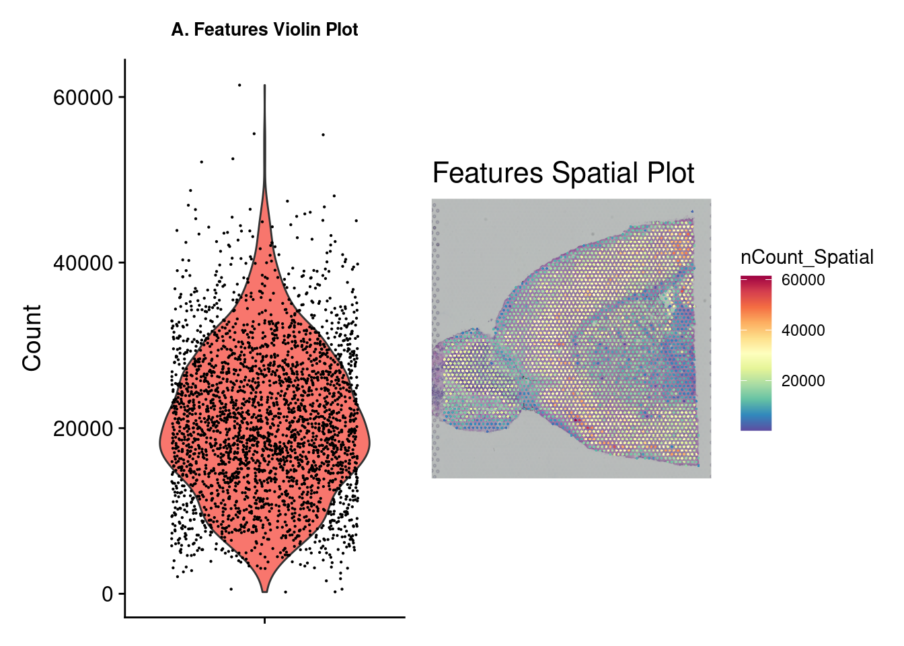
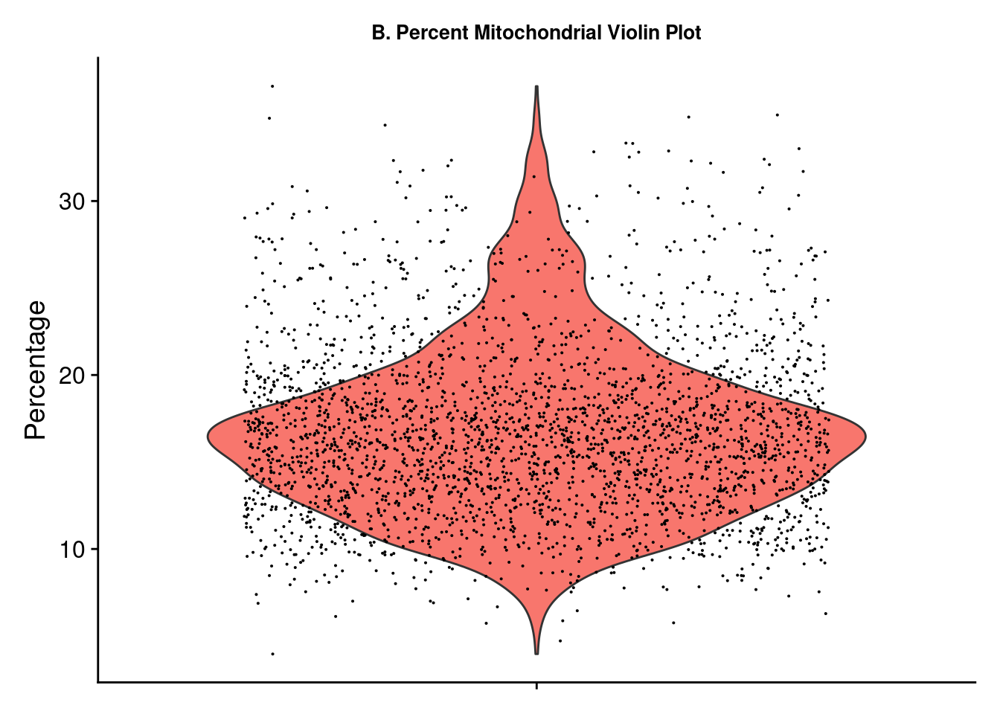
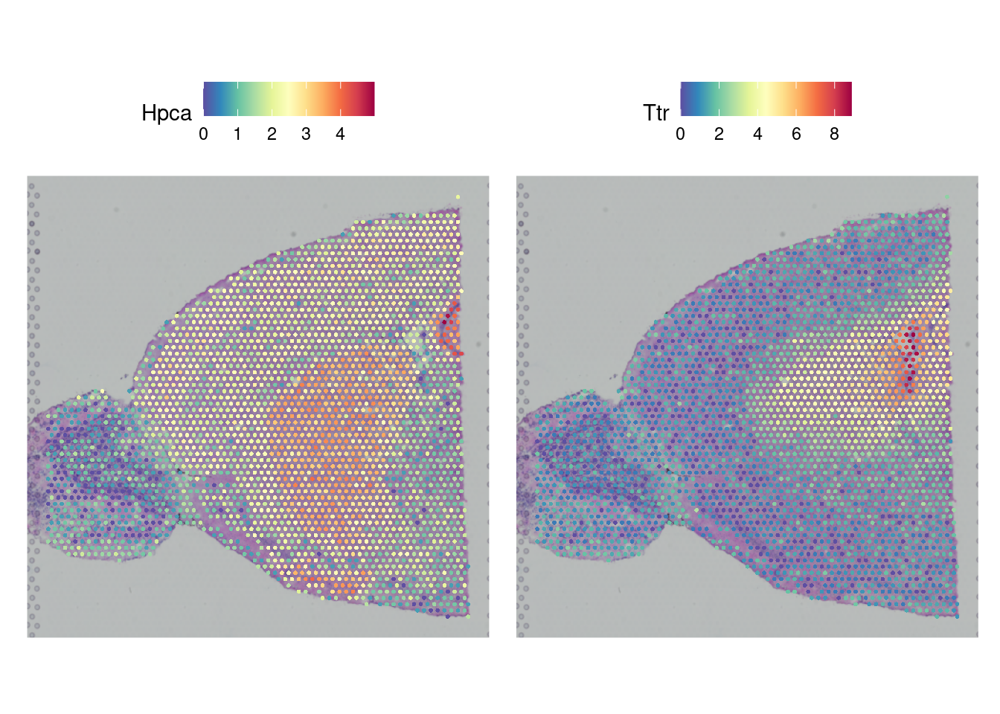
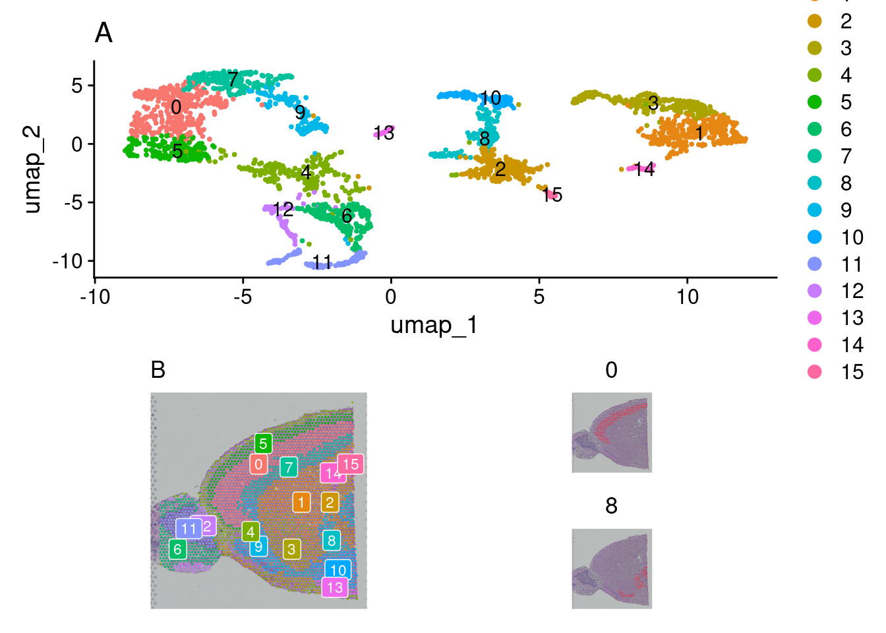
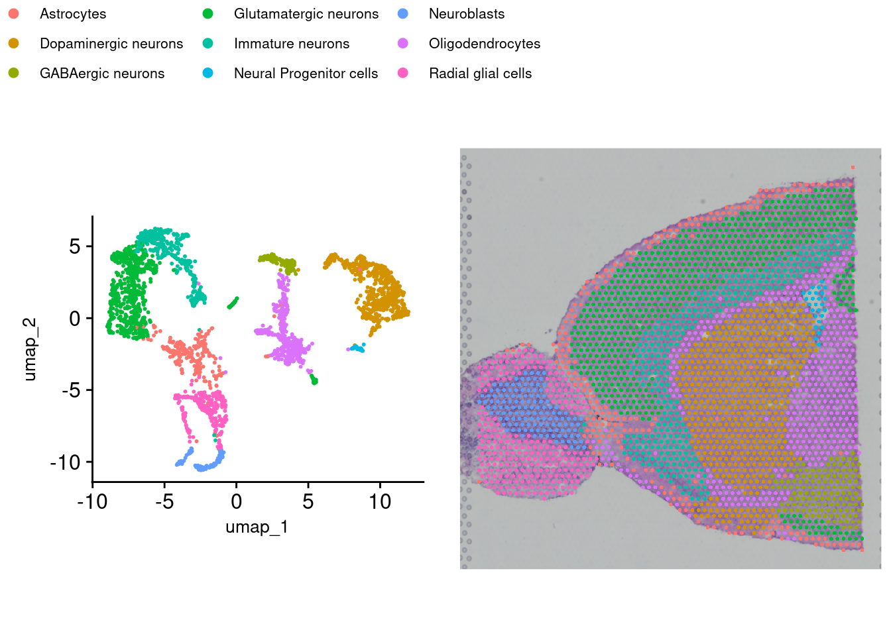

# QC, Clustering, and Annotating with Seurat


First, we will import the necessary Space Ranger output and perform some QC on the gene expression data. Then the gene expression and spatial data will be used to group (cluster) cells. Finally, we will annotate the clusters by cell type.

Let's load the necessary libraries.


``` r
rm(list = ls()) # This clears your environment of any variables there. We do 
#this to keep things tidy.
library(ggplot2)
library(ggpubr)
library(cowplot)
library(patchwork)
library(dplyr)
source("https://raw.githubusercontent.com/IanevskiAleksandr/sc-type/master/R/sctype_wrapper.R"); 
library(HGNChelper)
library(Seurat)

# Easy to change variables for our project folder structure
data_dir <- "datasets"
figs_dir <- "figures"

# This sets to the size of figures in inches
two_panel = 3.5
one_pnael = two_panel/2
# We can do automatic figure numbering. We start with 2 as the flowchart is figure 1
fig_num = 1
```

## Importing and QC

### Load in the data

A Seurat object must first be constructed from the hdf5 file and spatial folder. This object is a special data type, holding all of the information about the sample and any additional information as a result of the analyses performed here. Image data can be read from the spatial folder via the `Read10X_Image` command and stored as a variable. This variable can then be used in the `Load10X_Spatial` command along with the hdf5 filename to load the data.


``` r
mouse_h5 <- "V1_Mouse_Brain_Sagittal_Anterior_Section_2_filtered_feature_bc_matrix.h5"
mouse_image <- Read10X_Image(image.dir = paste0(data_dir, "/spatial"))
brain_ant <- Load10X_Spatial(data.dir = data_dir, filename = mouse_h5, 
                             assay = "Spatial", image = mouse_image)
```

### Trim and filter

A few plots may be viewed for quick data exploration. The `VlnPlot` and `SpatialFeaturePlot` functions with the `nCount_Spatial` option display the distribution of spatial features in the sample. This demonstrates that molecular counts vary across the sample as a result of technical variations but also tissue type. We may want to remove feature counts that are exceptionally low or extremely high. Using the `PercentageFeaturesSet` command with a pattern matching “^mt-” (often the designation for mitochondrial RNA) and a `VlnPlot` selected for this feature allows us to visualize the percentage mitochondrial RNA counts in samples. It is suggested to eliminate cells with high amounts of mitochondrial RNA as this will contribute noise to expression data. There is no definitive rule or cutoffs for this step and largely depends on the researcher's evaluation of the data.


``` r
brain_ant[["percent.mt"]] <- PercentageFeatureSet(brain_ant, pattern = "^mt-")
figa <- VlnPlot(brain_ant, features = "nCount_Spatial", pt.size = 0.1) + 
          NoLegend() + labs(title = "A. Features Violin Plot", y = "Count") +
          theme(axis.title.x = element_blank(), axis.text.x = element_blank(), 
                plot.title = element_text(size = 10), 
                text = element_text(family = "Helvetica"))
figb <- SpatialFeaturePlot(brain_ant, features = "nCount_Spatial") + 
          labs(title = "Features Spatial Plot") +
          theme(legend.position = "right", plot.title = element_text(size = 16),
                text = element_text(family = "Helvetica"))
figc <- VlnPlot(brain_ant, features = "percent.mt") + NoLegend() + 
          labs(title = "B. Percent Mitochondrial Violin Plot", y = "Percentage") +
          theme(axis.title.x = element_blank(), axis.text.x = element_blank(),
                plot.title = element_text(size = 10),
                text = element_text(family = "Helvetica"))
wrap_plots(figa, figb)
```



``` r
figc
```



``` r
ggsave(filename = paste0(figs_dir, "/Figure_clust_", fig_num, ".png"), plot = wrap_plots(figa, figb, figc), units = "in", width = two_panel * (7/4), height = two_panel, dpi = 300)
fig_num = fig_num + 1
```

Based on the plots above, we use the `subset` function to select samples with a mitochondrial percent < 30 and a feature count < 50,000.


``` r
brain_ant <- subset(brain_ant, 
                    subset = percent.mt < 30 & nCount_Spatial < 50000)
```

### Normalization

Next we need to normalize the data using SCTransform. Normalization is a common step to remove from samples technical variation that may interfere with downstream analsysis. Many normalization methods exist, most often log normalization is used with RNA-seq. Log normalization assumes all cells have the same number of RNA molecules, which is often far from the case and would therefore require more steps to account for this assumption.  Seurat has its own method called `SCTransform` which combines the normalization and correction steps into a single command.


``` r
brain_ant <- SCTransform(brain_ant, assay = "Spatial", verbose = FALSE)
```

## Visualizing Gene Expression

Now that we have normalized gene expression, we can visualize this on the tissue sample image. Depending on the tissue under study and our goals, it may be interesting to pick a marker that can distinguish the anatomical structure of the sample. This plot overlays the expression of chosen genes over the provided tissue H&E image. We can see that the expression is not heterogeneous for all genes. In the next section, we will use a method to find out which expressions vary significantly across the tissue.

Note, these images are ggplot images and can therefore be customized using ggplot options.


``` r
fig <- SpatialFeaturePlot(brain_ant, features = c("Hpca", "Ttr")) &
        theme(plot.title = element_text(size = 16, hjust = "left"),
                text = element_text(family = "Helvetica"))
fig
```



``` r
ggsave(filename = paste0(figs_dir, "/Figure_clust_", fig_num, ".png"), plot = fig,
       units = "in", width = two_panel * (7/4), height = two_panel, dpi = 300)
fig_num = fig_num + 1
```

## Dimention Reduction and Clustering

When clustering, any number of variables can be considered. However, it is not necessary to include ALL variables as some contribute very little overall or even add noise. Dimension reduction pairs down the parameter list to only those that contribute meaningfully to the analysis. This is achieved here by using `RunPCA` on the transformed data. Now we can group cells using `FindNeighbors`, `FindClusters`, and `RunUMAP`. Briefly, Seurat uses a graph-based approach to clustering starting with a K-Nearest Neighbors graph based on the PCA space, then uses a Louvian algorithm to cluster the cells before a final non-linear dimensional reduction is performed with UMAP.


``` r
brain_ant <- RunPCA(brain_ant, assay = "SCT", verbose = FALSE)
brain_ant <- FindNeighbors(brain_ant, reduction = "pca", dims = 1:30)
```

```
## Computing nearest neighbor graph
```

```
## Computing SNN
```

``` r
brain_ant <- FindClusters(brain_ant, verbose = FALSE)
brain_ant <- RunUMAP(brain_ant, reduction = "pca", dims = 1:30)
```

```
## 11:55:42 UMAP embedding parameters a = 0.9922 b = 1.112
```

```
## 11:55:42 Read 2779 rows and found 30 numeric columns
```

```
## 11:55:42 Using Annoy for neighbor search, n_neighbors = 30
```

```
## 11:55:42 Building Annoy index with metric = cosine, n_trees = 50
```

```
## 0%   10   20   30   40   50   60   70   80   90   100%
```

```
## [----|----|----|----|----|----|----|----|----|----|
```

```
## **************************************************|
## 11:55:42 Writing NN index file to temp file /tmp/Rtmp9odOJO/fileab8976572a8d
## 11:55:42 Searching Annoy index using 1 thread, search_k = 3000
## 11:55:43 Annoy recall = 100%
## 11:55:43 Commencing smooth kNN distance calibration using 1 thread with target n_neighbors = 30
## 11:55:44 Initializing from normalized Laplacian + noise (using RSpectra)
## 11:55:44 Commencing optimization for 500 epochs, with 109402 positive edges
## 11:55:44 Using rng type: pcg
## 11:55:47 Optimization finished
```

## Visualizing Clusters

There are a few options for visualization of our clusters. First, a traditional UMAP plot showing our clustering results with this `DimPlot` function. `SpatialDimPlot` will show the distribution of identified clusters by overlaying them onto our tissue image. Giving `SpatialDimPlot` a few cluster identities allows us to highlight the location of selected clusters.

Again, these are ggplot objects that can be customized using the ggplot2 package.


``` r
figa <- DimPlot(brain_ant, reduction = "umap", label = TRUE) +
                labs(title = "A") +
                theme(text = element_text(family = "Helvetica"),
                      plot.title = element_text(face = "plain"))
figb1 <-SpatialDimPlot(brain_ant, label = TRUE, label.size = 3) + 
        labs(title = "B", fill = "Cluster") + 
        theme(text = element_text(family = "Helvetica")) + NoLegend()
figb2 <- SpatialDimPlot(brain_ant, 
                        cells.highlight = CellsByIdentities(object = 
                                        brain_ant, idents = c(0,8)),
                        facet.highlight = TRUE, ncol = 1)
figb <- wrap_plots(figb1, figb2)
wrap_plots(figa, figb, ncol = 1)
```



``` r
ggsave(filename = paste0(figs_dir, "/Figure_clust_", fig_num, ".png"), plot = wrap_plots(figa, figb, ncol = 1),
       units = "in", width = two_panel * (7/4), height = two_panel * 2, dpi = 300)
fig_num = fig_num + 1
```

## Spot Annotating

A final step required is to annotate our clusters by assigning them cell types. This process is not single-cell resolution as our clusters consist of “spots” that contain several cells each (a characteristic of the 10X Visium platform used here). Deconvolution is needed to estimate individual cell types in each spot and is a separate step.

While there are automated methods to do this, they are far from perfect, and the best way to annotate your samples is to have domain knowledge of markers that indicate cell types. If particular markers are known, expression can be viewed by cluster via a violin plot to assist in confirming. Several methods exist to perform this step. `SingleR` with `celldex` is a popular method. Another method is `Azimuth`. Here, we will use Sc-Type. The `run_sctype` function has built-in references if we provide “Brain” as the tissue type. Note that this reference is currently only for human tissue so the match will not be perfect for our data here. We can then show the new cluster assignments using `DimPlot` and `SpatialDimPlot`.


``` r
brain_ant <- run_sctype(brain_ant, assay = "SCT", scaled = TRUE,
                     known_tissue_type="Brain", name="sctype_classification")
```

```
## [1] "Using Seurat v4 object"
## [1] "New metadata added:  sctype_classification"
```

``` r
figa <- DimPlot(brain_ant, group.by = "sctype_classification", pt.size = .25) + 
                labs(title = "") +
                theme(text = element_text(family = "Helvetica", size = 10), 
                       legend.position = "bottom", 
                       legend.key.spacing.x = unit(0.25, "cm"),
                       legend.key.spacing.y = unit(0.05, "cm"),
                       legend.text = element_text(size = 8)) +
                coord_fixed(ratio =1) +
                guides(color = guide_legend(nrow = 3,
                                              override.aes = list(size = 2)))
leg <- get_legend(figa)
figb <- SpatialDimPlot(brain_ant, group.by= "sctype_classification") +
                        NoLegend() + theme(plot.margin = margin(0, 0, 0, 0))
fig <- ggarrange(figa, figb, nrow = 1, common.legend = TRUE)
fig
```



``` r
ggsave(filename = paste0(figs_dir, "/Figure_clust_", fig_num, ".png"),
       plot = fig, units = "in", width = two_panel * (7/4), height = two_panel,
       dpi = 300)
fig_num = fig_num + 1
```

## Saving the data

Finally, we save the Seurat object with `saveRDS`. This file can be loaded again to add other annotations or create more figures without having to repeat the analysis. This same object will also serve as the starting point in subsequent steps.


``` r
saveRDS(brain_ant, file = paste0(data_dir, "/cluster_mouse_brain.rds"))
```
<br>
<br>
<br>

``` r
sessionInfo()
```

```
## R version 4.4.3 (2025-02-28)
## Platform: x86_64-pc-linux-gnu
## Running under: Linux Mint 21
## 
## Matrix products: default
## BLAS:   /usr/lib/x86_64-linux-gnu/blas/libblas.so.3.10.0 
## LAPACK: /usr/lib/x86_64-linux-gnu/lapack/liblapack.so.3.10.0
## 
## locale:
##  [1] LC_CTYPE=en_US.UTF-8       LC_NUMERIC=C              
##  [3] LC_TIME=en_US.UTF-8        LC_COLLATE=en_US.UTF-8    
##  [5] LC_MONETARY=en_US.UTF-8    LC_MESSAGES=en_US.UTF-8   
##  [7] LC_PAPER=en_US.UTF-8       LC_NAME=C                 
##  [9] LC_ADDRESS=C               LC_TELEPHONE=C            
## [11] LC_MEASUREMENT=en_US.UTF-8 LC_IDENTIFICATION=C       
## 
## time zone: America/New_York
## tzcode source: system (glibc)
## 
## attached base packages:
## [1] stats     graphics  grDevices utils     datasets  methods   base     
## 
## other attached packages:
## [1] Seurat_5.2.1       SeuratObject_5.0.2 sp_2.2-0           HGNChelper_0.8.15 
## [5] dplyr_1.1.4        patchwork_1.3.0    cowplot_1.1.3      ggpubr_0.6.0      
## [9] ggplot2_3.5.1     
## 
## loaded via a namespace (and not attached):
##   [1] RcppAnnoy_0.0.22            splines_4.4.3              
##   [3] later_1.4.1                 tibble_3.2.1               
##   [5] polyclip_1.10-7             fastDummies_1.7.5          
##   [7] lifecycle_1.0.4             rstatix_0.7.2              
##   [9] globals_0.16.3              lattice_0.22-5             
##  [11] hdf5r_1.3.12                MASS_7.3-64                
##  [13] backports_1.5.0             magrittr_2.0.3             
##  [15] openxlsx_4.2.8              plotly_4.10.4              
##  [17] sass_0.4.9                  rmarkdown_2.29             
##  [19] jquerylib_0.1.4             yaml_2.3.10                
##  [21] httpuv_1.6.15               glmGamPoi_1.18.0           
##  [23] sctransform_0.4.1           zip_2.3.2                  
##  [25] spam_2.11-1                 spatstat.sparse_3.1-0      
##  [27] reticulate_1.41.0           pbapply_1.7-2              
##  [29] RColorBrewer_1.1-3          abind_1.4-8                
##  [31] zlibbioc_1.52.0             Rtsne_0.17                 
##  [33] GenomicRanges_1.58.0        purrr_1.0.4                
##  [35] BiocGenerics_0.52.0         GenomeInfoDbData_1.2.13    
##  [37] IRanges_2.40.1              S4Vectors_0.44.0           
##  [39] ggrepel_0.9.6               irlba_2.3.5.1              
##  [41] listenv_0.9.1               spatstat.utils_3.1-2       
##  [43] goftest_1.2-3               RSpectra_0.16-2            
##  [45] spatstat.random_3.3-2       fitdistrplus_1.2-2         
##  [47] parallelly_1.42.0           DelayedMatrixStats_1.28.1  
##  [49] codetools_0.2-19            DelayedArray_0.32.0        
##  [51] tidyselect_1.2.1            UCSC.utils_1.2.0           
##  [53] farver_2.1.2                matrixStats_1.5.0          
##  [55] stats4_4.4.3                spatstat.explore_3.3-4     
##  [57] jsonlite_1.9.0              progressr_0.15.1           
##  [59] Formula_1.2-5               ggridges_0.5.6             
##  [61] survival_3.8-3              systemfonts_1.2.1          
##  [63] tools_4.4.3                 ragg_1.3.3                 
##  [65] ica_1.0-3                   Rcpp_1.0.14                
##  [67] glue_1.8.0                  SparseArray_1.6.2          
##  [69] gridExtra_2.3               xfun_0.51                  
##  [71] MatrixGenerics_1.18.1       GenomeInfoDb_1.42.3        
##  [73] withr_3.0.2                 fastmap_1.2.0              
##  [75] digest_0.6.37               R6_2.6.1                   
##  [77] mime_0.12                   textshaping_1.0.0          
##  [79] colorspace_2.1-1            scattermore_1.2            
##  [81] tensor_1.5                  spatstat.data_3.1-4        
##  [83] tidyr_1.3.1                 generics_0.1.3             
##  [85] data.table_1.17.0           httr_1.4.7                 
##  [87] htmlwidgets_1.6.4           S4Arrays_1.6.0             
##  [89] uwot_0.2.3                  pkgconfig_2.0.3            
##  [91] gtable_0.3.6                lmtest_0.9-40              
##  [93] XVector_0.46.0              htmltools_0.5.8.1          
##  [95] carData_3.0-5               dotCall64_1.2              
##  [97] bookdown_0.42               scales_1.3.0               
##  [99] Biobase_2.66.0              png_0.1-8                  
## [101] spatstat.univar_3.1-1       knitr_1.49                 
## [103] rstudioapi_0.17.1           reshape2_1.4.4             
## [105] nlme_3.1-168                cachem_1.1.0               
## [107] zoo_1.8-13                  stringr_1.5.1              
## [109] KernSmooth_2.23-26          parallel_4.4.3             
## [111] miniUI_0.1.1.1              pillar_1.10.1              
## [113] grid_4.4.3                  vctrs_0.6.5                
## [115] RANN_2.6.2                  promises_1.3.2             
## [117] car_3.1-3                   xtable_1.8-4               
## [119] cluster_2.1.8.1             evaluate_1.0.3             
## [121] cli_3.6.4                   compiler_4.4.3             
## [123] rlang_1.1.5                 crayon_1.5.3               
## [125] future.apply_1.11.3         ggsignif_0.6.4             
## [127] labeling_0.4.3              plyr_1.8.9                 
## [129] stringi_1.8.4               viridisLite_0.4.2          
## [131] deldir_2.0-4                munsell_0.5.1              
## [133] lazyeval_0.2.2              spatstat.geom_3.3-5        
## [135] Matrix_1.7-2                RcppHNSW_0.6.0             
## [137] sparseMatrixStats_1.18.0    bit64_4.6.0-1              
## [139] future_1.34.0               shiny_1.10.0               
## [141] SummarizedExperiment_1.36.0 ROCR_1.0-11                
## [143] igraph_2.1.4                broom_1.0.7                
## [145] bslib_0.9.0                 bit_4.5.0.1                
## [147] splitstackshape_1.4.8
```
