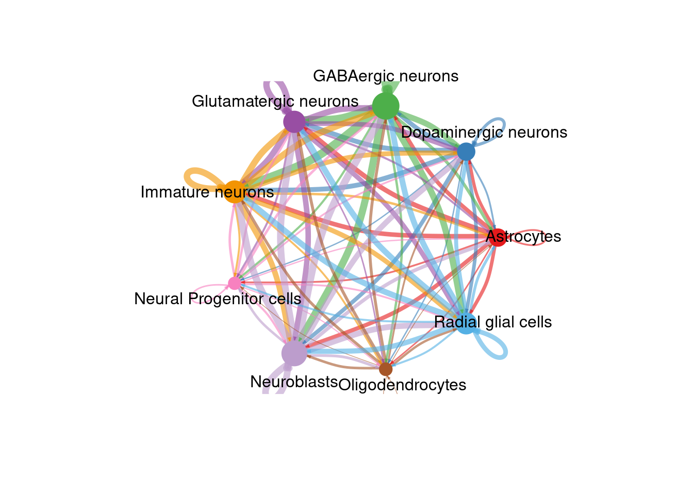
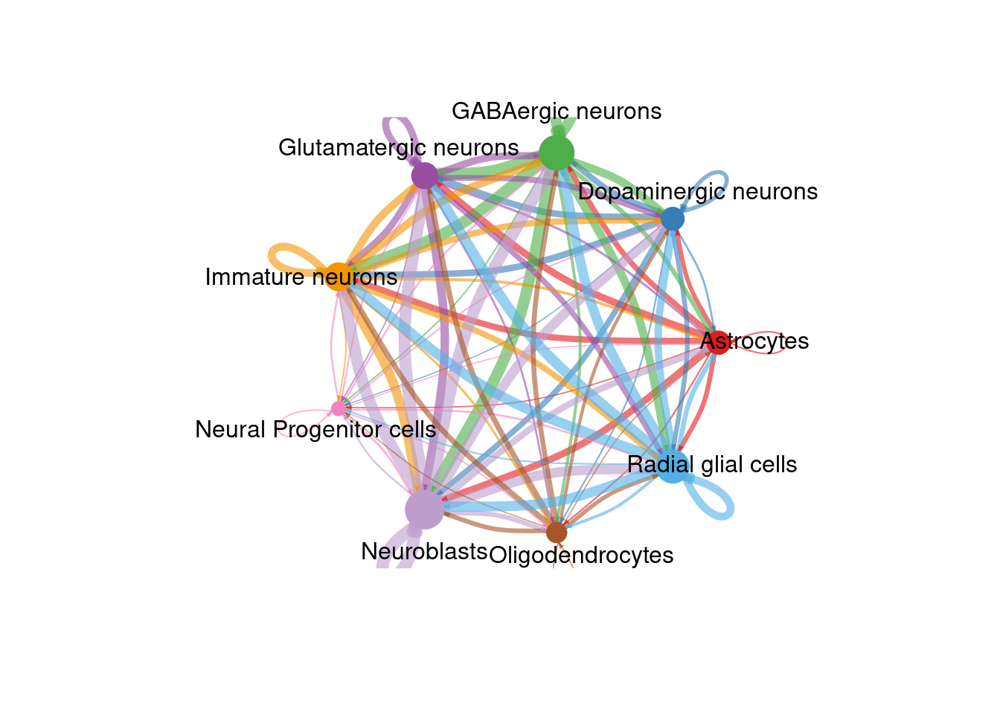
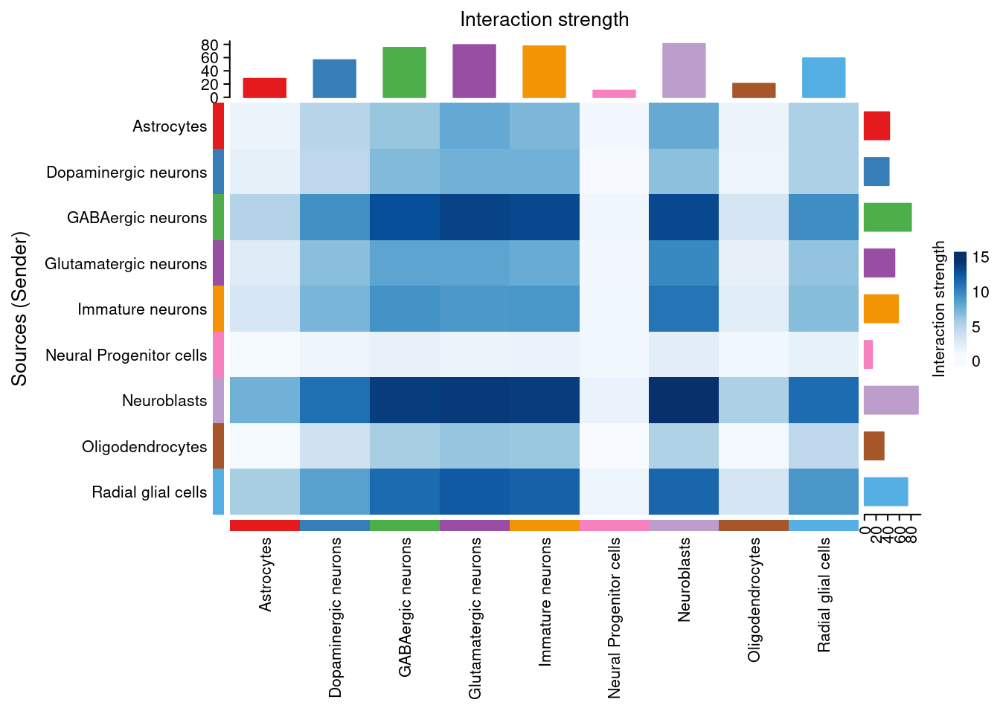
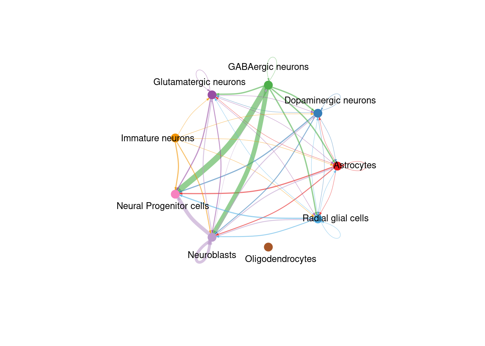
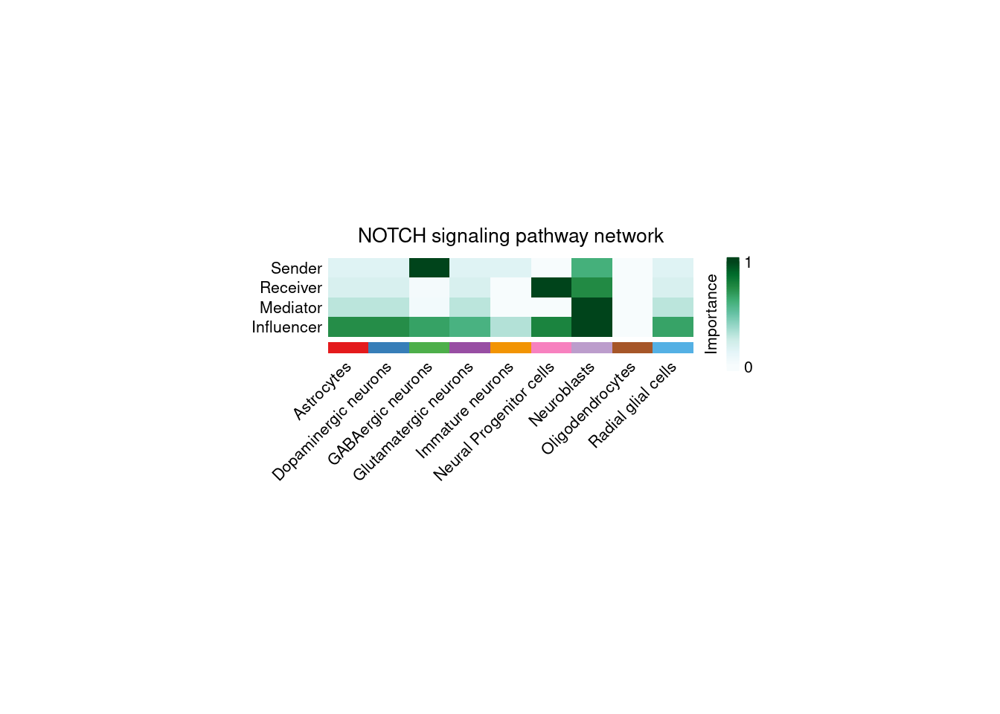

# Cell-Cell Communication with CellChat


Cells communicate by releasing and receiving molecular messages called ligands. Ligands bind to receptors, often found on cell surfaces. This binding then activates a reaction or pathway that leads to a cell function. Due to decades of research, we know which ligands typically bind to which receptors. Thanks to the scRNA-seq data for our sample we know which cells are expressing either the ligand or receptor in a canonical communication pair. As we also have spatial data available, we can use statistics to predict which cells are most likely communicating with one another based on ligand-receptor gene expression and physical distance from one another.

One factor that heavily influences the results of any CCC analysis is the ligand-receptor database used. Indeed the same method can return two drastically different results merely by working from two different ligand-receptor pair lists. CellChat has its own database, CellChatDB, which is manually curated and takes into account things like subunit structure and regulatory pathways. The database is not exhaustive, however, and some ligand-receptor pairs may be missing. Users are able to update the database following the instructions [here](https://htmlpreview.github.io/?https://github.com/jinworks/CellChat/blob/master/tutorial/Update-CellChatDB.html)

Another important factor is your annotations previously added in the Clustering step. CellChat will group samples by these annotations to determine which groups are potentially communicating with one another. Be sure your sample is well annotated to obtain the most accurate communication network.

As always, let's load our libraries.


``` r
rm(list = ls())
library(Seurat)
library(CellChat)
library(patchwork)

data_dir <- "datasets"
fig_dir <- "figures"

# This sets to the size of figures in inches
two_panel = 3.5
one_pnael = two_panel/2
# We can do automatic figure numbering.
fig_num = 1
```

## Importing Data and Setting Computer Options

Once again, we can load in the rds of the Seurat object from clustering. No SVG data is saved in the object from the previous section but it is not needed here. This step is very time intensive, potentially requiring several hours on a personal or office machine. Two options can speed up the process, however.

R generally reserves only a small amount of RAM for calculations (~500MB) which is easily not enough for this step. We can set an option for the future.globals.maxSize to take advantage of a larger amount of RAM. The exact number will be system-dependent, here we used 32GB of RAM by providing the value 32000 * 1024 ^ 8. We can take advantage of a multicore processor by utilizing the `future::plan` function to set the number of cores we would like to use for CCC.


``` r
brain_ant <- readRDS(paste0(data_dir, "/cluster_mouse_brain.rds"))
options(stringsAsFactors = FALSE)
options(future.globals.maxSize = 32000*1024^2) # Here we decide to use 32GB RAM out of 48 available. You can set this to whatever number you want.
future::plan("multisession", workers = 8) # This is the number of cores on which you want this to run. This will depend on how many cores your CPU has. We had 12 available and used 8 here.
```

## Preparing CellChat Object and Database

There is a single command needed to create a CellChat object from a Seurat object. Preparing the database is somewhat more complicated. CellChat has two main databases, one for human and one for mouse. The databases contain a variety of communication modes including secretionary, cell-cell contact, and non-protein signaling. Depending on our cell types and desired research direction, these databases can be subset to focus only on specific interaction lists which may decrease processing time and simplify results.

We also need to convert pixels in the H&E image to real-world measurements using the `scalefactors_json.json` file provided in the Space Ranger output and the spot size of the 10X Visium assay (usually 55μm). A CellChat object can then be created with the aptly named `createCellChat` function.


``` r
spatial.locs = GetTissueCoordinates(brain_ant, scale = NULL, 
                                    cols = c("imagerow", "imagecol"))
spatial.locs <- spatial.locs[,c(1,2)]
scalefactors = jsonlite::fromJSON(txt = file.path(paste0(data_dir, "/spatial/scalefactors_json.json")))
spot.size = 55 # The current spot size (um) in 10X Visium. This is assay specific and you should double check this value!
conversion.factor = spot.size/scalefactors$spot_diameter_fullres
spatial.factors = data.frame(ratio = conversion.factor, tol = spot.size/2)
d.spatial <- computeCellDistance(coordinates = spatial.locs, 
                                 ratio = spatial.factors$ratio, 
                                 tol = spatial.factors$tol)
min(d.spatial[d.spatial!=0]) # this value should approximately equal 100um for 10X Visium data
```

```
## [1] 84.21583
```

``` r
# create the CellChat object
cellChat <- createCellChat(brain_ant, group.by = "sctype_classification",
                           assay = "SCT", coordinates = spatial.locs,
                           spatial.factors = spatial.factors)
```

```
## [1] "Create a CellChat object from a Seurat object"
## The `meta.data` slot in the Seurat object is used as cell meta information
```

```
## Set cell identities for the new CellChat object 
## The cell groups used for CellChat analysis are  Astrocytes, Dopaminergic neurons, GABAergic neurons, Glutamatergic neurons, Immature neurons, Neural Progenitor cells, Neuroblasts, Oligodendrocytes, Radial glial cells
```

``` r
CellChatDB <- CellChatDB.mouse
# use all CellChatDB for cell-cell communication analysis. We do not suggest to use it in this way because CellChatDB v2 includes "Non-protein Signaling" (i.e., metabolic and synaptic signaling) that can be only estimated from gene expression data.
CellChatDB.use <- CellChatDB
# Or optional subsetting
# CellChatDB.use <- subsetDB(CellChatDB, search = "Secreted Signaling", key = "annotation")
# set the used database in the object
cellChat@DB <- CellChatDB.use
```

## Running CellChat

Before finding all ligand-receptor pairs, over-expressed genes and interactions are found to infer the cell state-specific communications using `identifyOverExpressedGenes` and `identifyOverExpressedInteractions` respectively. If the sequencing depth is shallow, we can use `smoothData` to smooth genes' expressions based on neighbors' validated and high-confidence protein-protein network. If smoothing is used, the parameter `raw = FALSE` should be added to the `computeCommunProb` function.


``` r
cellChat <- subsetData(cellChat) # This step is necessary even if using the whole database
cellChat <- identifyOverExpressedGenes(cellChat)
cellChat <- identifyOverExpressedInteractions(cellChat, variable.both = FALSE)

# project gene expression data onto PPI (Optional: when running it, USER should set `raw.use = FALSE` in the function `computeCommunProb()` in order to use the projected data)
#cellChat <- smoothData(cellChat, adj = PPI.mouse)
```

CellChat offers two options for calculating ligand-receptor pairs, `triMean` which produces fewer but stronger interactions, and `truncatedMean` to identify weaker signaling. We use our chosen option in `computeCommunProb` to run the calculation. This function can take several hours to run, especially if using a personal computer instead of sever cluster. Thankfully, a progress bar is conveniently displayed.

After our list is obtained, we filter out groups that have only a few cells on which to predict communication with `filterCommunication`. Next, `computeCommunProbPathway` will use the ligand-receptor interactions to calculate the communication probability on a signaling pathway and can then aggregate an entire communication network using `aggregateNet`. As the previous step takes a significant amount of time, it is best to save our analysis as an rds file.


``` r
cellChat <- computeCommunProb(cellChat, type = "triMean", distance.use = TRUE,
                              interaction.range = 250, scale.distance = 0.01,
                              contact.dependent = TRUE, contact.range = 84)
cellChat <- filterCommunication(cellChat, min.cells = 10)
cellChat <- computeCommunProbPathway(cellChat)
cellChat <- aggregateNet(cellChat)

# That took a long time. Let's save this object for easy laoding later!
saveRDS(cellChat, file = paste0(data_dir, "/cellchat_visium_mouse_cortex.rds"))
```

## Visualizing CCC

There are many figures and graphs that can be created for CCC analysis. First, using `netVisual-circle`, we can view communications between each cell group of cells from the clustering step. The vertex and line weights can be set to a number of parameters, including the number of interactions and the strength of the interactions. The same information can alternatively be viewed as heatmaps using “netVisual_heatmap”.


``` r
# Remove the # from the line below to load your previous CellChat data if you don't want to rerun the whole thing!
cellChat <- readRDS(paste0(data_dir, "/cellchat_visium_mouse_cortex.rds"))

# These aren't ggplot objects so we have to save them a bit differently
png(filename = paste0(fig_dir, "/Figure_ccc_", fig_num, ".png"), width = two_panel*2, height = two_panel*2, units = "in", res = 300)
par(mfrow = c(1,1), xpd=TRUE)
count_plot <- netVisual_circle(cellChat@net$count, 
                 vertex.weight = rowSums(cellChat@net$count),
                 weight.scale = TRUE, label.edge= FALSE, margin = c(0,0,0,0))
count_plot
dev.off()
```

```
## png 
##   2
```

``` r
fig_num <- fig_num + 1
netVisual_circle(cellChat@net$count, 
                 vertex.weight = rowSums(cellChat@net$count),
                 weight.scale = TRUE, label.edge= FALSE, margin = c(0,0,0,0))
```



``` r
png(filename = paste0(fig_dir, "/Figure_ccc_", fig_num, ".png"), width = two_panel*2, height = two_panel*2, units = "in", res = 300)
par(mfrow = c(1,1), xpd=TRUE)
int_plot <- netVisual_circle(cellChat@net$weight, vertex.weight =
                 rowSums(cellChat@net$weight), weight.scale = TRUE,
                 label.edge= FALSE, margin = c(0,0,0,0))
int_plot
dev.off()
```

```
## png 
##   2
```

``` r
fig_num <- fig_num + 1
netVisual_circle(cellChat@net$weight, vertex.weight =
                 rowSums(cellChat@net$weight), weight.scale = TRUE,
                 label.edge= FALSE, margin = c(0,0,0,0))
```



``` r
png(filename = paste0(fig_dir, "/Figure_ccc_", fig_num, ".png"), width = two_panel*1.5, height = two_panel, units = "in", res = 300)
par(mfrow = c(1,1), xpd=TRUE)
count_map <- netVisual_heatmap(cellChat, measure = "count", color.heatmap = "Blues")
count_map
dev.off()
```

```
## png 
##   2
```

``` r
fig_num <- fig_num + 1
netVisual_heatmap(cellChat, measure = "count", color.heatmap = "Blues")
```


``` r
png(filename = paste0(fig_dir, "/Figure_ccc_", fig_num, ".png"), width = two_panel*1.5, height = two_panel, units = "in", res = 300)
par(mfrow = c(1,1), xpd=TRUE)
weight_map <- netVisual_heatmap(cellChat, measure = "weight", color.heatmap = "Blues")
weight_map
dev.off()
```

```
## png 
##   2
```

``` r
fig_num <- fig_num + 1
netVisual_heatmap(cellChat, measure = "weight", color.heatmap = "Blues")
```



If we are interested in a particular signaling pathway, a list of communication probabilities is available in the CellChat object metadata. We can look at the probability of interactions between cell groups involved in the NOTCH pathway with the `netVisual_aggregate` function.


``` r
# Visualize pathways
cellChat@netP$pathways
```

```
##   [1] "Glutamate"        "GABA-A"           "GABA-B"          
##   [4] "NRXN"             "CypA"             "ADGRL"           
##   [7] "PTPR"             "CADM"             "PTN"             
##  [10] "PSAP"             "LAMININ"          "APP"             
##  [13] "MK"               "NCAM"             "CNTN"            
##  [16] "ADGRB"            "SLITRK"           "EPHB"            
##  [19] "GAP"              "COLLAGEN"         "MAG"             
##  [22] "CLDN"             "ApoE"             "NEGR"            
##  [25] "SEMA4"            "OPIOID"           "SEMA6"           
##  [28] "GAS"              "VTN"              "CCK"             
##  [31] "GRN"              "FGF"              "FN1"             
##  [34] "VEGF"             "NGL"              "EPHA"            
##  [37] "NTS"              "AGRN"             "RELN"            
##  [40] "JAM"              "NPY"              "2-AG"            
##  [43] "CDH"              "SOMATOSTATIN"     "BMP"             
##  [46] "NECTIN"           "CX3C"             "Cholesterol"     
##  [49] "L1CAM"            "SEMA3"            "UNC5"            
##  [52] "CSF"              "THBS"             "SEMA5"           
##  [55] "WNT"              "SPP1"             "TENASCIN"        
##  [58] "NOTCH"            "NT"               "Desmosterol"     
##  [61] "ENHO"             "PACAP"            "PTPRM"           
##  [64] "SEMA7"            "SLIT"             "MPZ"             
##  [67] "Testosterone"     "FLRT"             "Netrin"          
##  [70] "TAC"              "MIF"              "IGF"             
##  [73] "Adenosine"        "ncWNT"            "PDGF"            
##  [76] "SerotoninDopamin" "ESAM"             "NRG"             
##  [79] "VIP"              "TGFb"             "ADGRG"           
##  [82] "KIT"              "HSPG"             "Glycine"         
##  [85] "ACTIVIN"          "AGT"              "TULP"            
##  [88] "MHC-II"           "VISFATIN"         "CXCL"            
##  [91] "IGFBP"            "GDF"              "EGF"             
##  [94] "VISTA"            "DHT"              "CRH"             
##  [97] "RBP4"             "LIFR"             "PCDH"            
## [100] "CSPG4"            "NPR1"             "OCLN"            
## [103] "PECAM1"           "ANGPTL"           "DHEAS"
```

``` r
pathways.show <- c("NOTCH") 
# Circle plot
png(filename = paste0(fig_dir, "/Figure_ccc_", fig_num, ".png"), width = two_panel*1.5, height = two_panel*1.5, units = "in", res = 300)
par(mfrow=c(1,1), xpd = TRUE) # `xpd = TRUE` should be added to show the title
pathway <- netVisual_aggregate(cellChat, signaling = pathways.show, layout = "circle")
pathway
dev.off()
```

```
## png 
##   2
```

``` r
fig_num <- fig_num + 1
netVisual_aggregate(cellChat, signaling = pathways.show, layout = "circle")
```



Finally, we can explore the "centrality" of a network. This tells us which nodes are active in the most pathways and therefore could be more "important". The calculation is done with “netAnalysis_computeCentrality” and visualized with `netAnalysis_signalingRole_network`.


``` r
# Compute the network centrality scores
cellChat <- netAnalysis_computeCentrality(cellChat, slot.name = "netP") # the slot 'netP' means the inferred intercellular communication network of signaling pathways
# Visualize the computed centrality scores using heatmap, allowing ready identification of major signaling roles of cell groups
png(filename = paste0(fig_dir, "/Figure_ccc_", fig_num, ".png"), width = two_panel*2, height = two_panel, units = "in", res = 300)
par(mfrow=c(1,1))
cent_map <- netAnalysis_signalingRole_network(cellChat, signaling = pathways.show)
cent_map
```

```
## NULL
```

``` r
dev.off()
```

```
## png 
##   2
```

``` r
fig_num <- fig_num + 1
netAnalysis_signalingRole_network(cellChat, signaling = pathways.show)
```



As we saved the CellChat object after the analysis and have not added to it since then, we do not need to save it again here.
<br>
<br>
<br>

``` r
sessionInfo()
```

```
## R version 4.4.3 (2025-02-28)
## Platform: x86_64-pc-linux-gnu
## Running under: Linux Mint 21
## 
## Matrix products: default
## BLAS:   /usr/lib/x86_64-linux-gnu/blas/libblas.so.3.10.0 
## LAPACK: /usr/lib/x86_64-linux-gnu/lapack/liblapack.so.3.10.0
## 
## locale:
##  [1] LC_CTYPE=en_US.UTF-8       LC_NUMERIC=C              
##  [3] LC_TIME=en_US.UTF-8        LC_COLLATE=en_US.UTF-8    
##  [5] LC_MONETARY=en_US.UTF-8    LC_MESSAGES=en_US.UTF-8   
##  [7] LC_PAPER=en_US.UTF-8       LC_NAME=C                 
##  [9] LC_ADDRESS=C               LC_TELEPHONE=C            
## [11] LC_MEASUREMENT=en_US.UTF-8 LC_IDENTIFICATION=C       
## 
## time zone: America/New_York
## tzcode source: system (glibc)
## 
## attached base packages:
## [1] stats     graphics  grDevices utils     datasets  methods   base     
## 
## other attached packages:
##  [1] patchwork_1.3.0     CellChat_2.1.2      Biobase_2.66.0     
##  [4] BiocGenerics_0.52.0 ggplot2_3.5.1       igraph_2.1.4       
##  [7] dplyr_1.1.4         Seurat_5.2.1        SeuratObject_5.0.2 
## [10] sp_2.2-0           
## 
## loaded via a namespace (and not attached):
##   [1] RcppAnnoy_0.0.22       splines_4.4.3          later_1.4.1           
##   [4] tibble_3.2.1           polyclip_1.10-7        ggnetwork_0.5.13      
##   [7] fastDummies_1.7.5      lifecycle_1.0.4        rstatix_0.7.2         
##  [10] doParallel_1.0.17      globals_0.16.3         lattice_0.22-5        
##  [13] MASS_7.3-64            backports_1.5.0        magrittr_2.0.3        
##  [16] plotly_4.10.4          sass_0.4.9             rmarkdown_2.29        
##  [19] jquerylib_0.1.4        yaml_2.3.10            httpuv_1.6.15         
##  [22] NMF_0.28               sctransform_0.4.1      spam_2.11-1           
##  [25] spatstat.sparse_3.1-0  reticulate_1.41.0      cowplot_1.1.3         
##  [28] pbapply_1.7-2          RColorBrewer_1.1-3     abind_1.4-8           
##  [31] Rtsne_0.17             purrr_1.0.4            circlize_0.4.16       
##  [34] IRanges_2.40.1         S4Vectors_0.44.0       ggrepel_0.9.6         
##  [37] irlba_2.3.5.1          listenv_0.9.1          spatstat.utils_3.1-2  
##  [40] goftest_1.2-3          RSpectra_0.16-2        spatstat.random_3.3-2 
##  [43] fitdistrplus_1.2-2     parallelly_1.42.0      svglite_2.1.3         
##  [46] codetools_0.2-19       tidyselect_1.2.1       shape_1.4.6.1         
##  [49] farver_2.1.2           matrixStats_1.5.0      stats4_4.4.3          
##  [52] spatstat.explore_3.3-4 jsonlite_1.9.0         GetoptLong_1.0.5      
##  [55] BiocNeighbors_2.0.1    progressr_0.15.1       Formula_1.2-5         
##  [58] ggridges_0.5.6         ggalluvial_0.12.5      survival_3.8-3        
##  [61] iterators_1.0.14       systemfonts_1.2.1      foreach_1.5.2         
##  [64] tools_4.4.3            sna_2.8                ica_1.0-3             
##  [67] Rcpp_1.0.14            glue_1.8.0             gridExtra_2.3         
##  [70] xfun_0.51              withr_3.0.2            BiocManager_1.30.25   
##  [73] fastmap_1.2.0          digest_0.6.37          R6_2.6.1              
##  [76] mime_0.12              colorspace_2.1-1       scattermore_1.2       
##  [79] tensor_1.5             spatstat.data_3.1-4    tidyr_1.3.1           
##  [82] generics_0.1.3         data.table_1.17.0      FNN_1.1.4.1           
##  [85] httr_1.4.7             htmlwidgets_1.6.4      uwot_0.2.3            
##  [88] pkgconfig_2.0.3        gtable_0.3.6           registry_0.5-1        
##  [91] ComplexHeatmap_2.22.0  lmtest_0.9-40          htmltools_0.5.8.1     
##  [94] carData_3.0-5          dotCall64_1.2          bookdown_0.42         
##  [97] clue_0.3-66            scales_1.3.0           png_0.1-8             
## [100] spatstat.univar_3.1-1  knitr_1.49             rstudioapi_0.17.1     
## [103] reshape2_1.4.4         rjson_0.2.23           coda_0.19-4.1         
## [106] statnet.common_4.11.0  nlme_3.1-168           cachem_1.1.0          
## [109] zoo_1.8-13             GlobalOptions_0.1.2    stringr_1.5.1         
## [112] KernSmooth_2.23-26     parallel_4.4.3         miniUI_0.1.1.1        
## [115] pillar_1.10.1          grid_4.4.3             vctrs_0.6.5           
## [118] RANN_2.6.2             promises_1.3.2         ggpubr_0.6.0          
## [121] car_3.1-3              xtable_1.8-4           cluster_2.1.8.1       
## [124] evaluate_1.0.3         cli_3.6.4              compiler_4.4.3        
## [127] rlang_1.1.5            crayon_1.5.3           rngtools_1.5.2        
## [130] future.apply_1.11.3    ggsignif_0.6.4         plyr_1.8.9            
## [133] stringi_1.8.4          viridisLite_0.4.2      network_1.19.0        
## [136] deldir_2.0-4           gridBase_0.4-7         munsell_0.5.1         
## [139] lazyeval_0.2.2         spatstat.geom_3.3-5    Matrix_1.7-2          
## [142] RcppHNSW_0.6.0         future_1.34.0          shiny_1.10.0          
## [145] ROCR_1.0-11            broom_1.0.7            bslib_0.9.0
```

